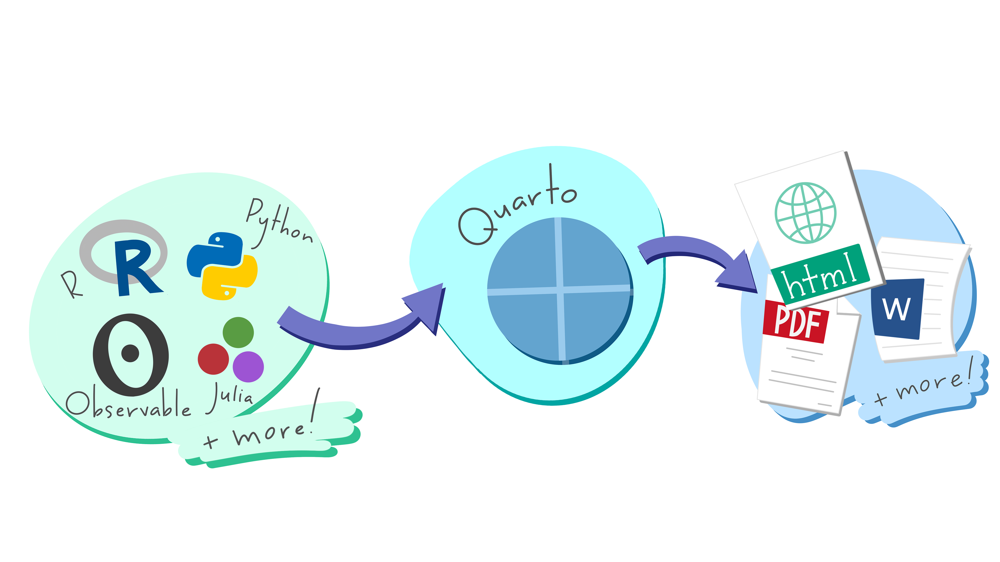

## Introductions: myself


My name is Dr. (or Professor) Catalina Medina 

::: {layout="[[1,1], [1]]"}

{fig-alt="Image of some grape vinyard with dry grass and hills."}

{fig-alt="Image of a city with some tall building surrounded by hills covered in snow."}

{fig-alt="Image of a coastline with beaches and houses."}
:::

## Introductions: you all

Please share: 

- Your name
- Your major
- Something you look forward to in this class
- Something you are worried about for this class

## Class information

All of our class information can be found on [**CI Learn**](https://cilearn.csuci.edu/).

## Quarto illustration

```{r}
#| echo: false
#| fig-alt: A schematic representing the multi-language input (e.g. Python, R, Observable, Julia) and multi-format output (e.g. PDF, html, Word documents, and more) versatility of Quarto.
#| fig-cap: "Artwork from 'Hello, Quarto' keynote by Julia Lowndes and Mine Çetinkaya-Rundel, presented at RStudio Conference 2022. Illustrated by Allison Horst."

```

## Lab

Let's kick off this class by looking at data and thinking about modeling!

In CI Learn under this week's module there is a lab-01a.qmd file (this is the lab for week 1 lecture a). Please download it and open it in RStudio. 
