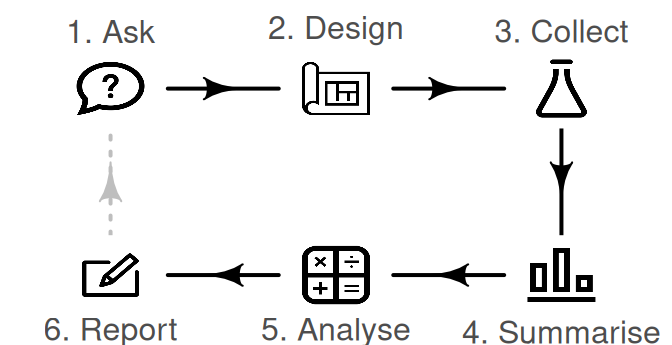
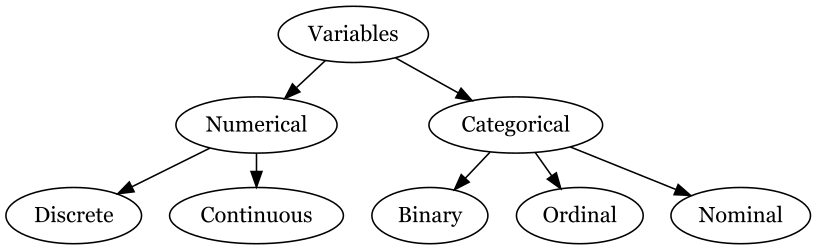
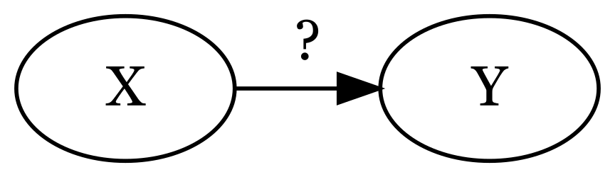
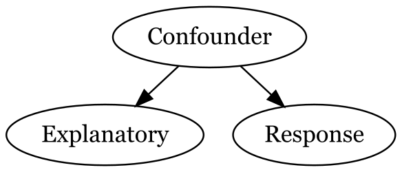
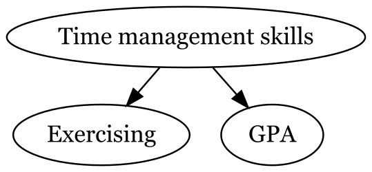

```{r}
library(tidyverse)
```

# Research process

```{r}
#| echo: false
#| fig-align: center
#| fig-out: 80%
#| fig-cap: "Image from <https://bookdown.org/pkaldunn/SRM-Textbook/Intro.html>"

```

# Variables

**Variables** are characteristics we measure and record as columns in our data

```{r}
#| label: diag-var-types
#| echo: false
#| fig-align: center
#| fig-alt: "Hierarchical diagram showing the classification of statistical variables. The diagram illustrates that variables are divided into two main categories: Categorical and Numerical. Categorical variables are further subdivided into Binary, Nominal, and Ordinal. Numerical variables are subdivided into Discrete and Continuous."
#| out-width: 80%
diagram <- DiagrammeR::grViz("
    digraph {
        # graph aesthetics
        graph [ranksep = 0.3]

        # node definitions with substituted label text
        1 [label = 'Variables']
        2 [label = 'Numerical']
        3 [label = 'Categorical']
        4 [label = 'Discrete']
        5 [label = 'Continuous']
        6 [label = 'Binary']
        7 [label = 'Ordinal']
        8 [label = 'Nominal']
        
        # edge definitions with the node
        1 -> 2
        1 -> 3
        2 -> 4
        2 -> 5
        3 -> 6
        3 -> 7
        3 -> 8
    }
")

tmp <- capture.output(rsvg::rsvg_png(
  charToRaw(DiagrammeRsvg::export_svg(diagram)),
  file = "img/diagram-variable-types.png",
  height = 250
))

 

```


## Numerical variables

**Numerical variables** (or quantitative) have mathematical meaning. There are two types:

- **Continuous variabels** are numerical variables with uncountably infinite number of possiblilities
  - Often measurements. Example: distance (2 miles, 2.2 miles 2.22 miles...)
- **Discrete variables** are numerical variables that are not continuous
  - Often variables that can only take integers. Example: number of siblings (0, 1, 2, 3, ...)
    
## Categorical variables

**Categorical variables** (or qualitative) do not have mathematical meaning. 

- **Binary variables** are categorical variables with only two options. Example: Can play guitar (true, false)
- **Ordinal variables** are categorical variables with a natural ordering. Example: seasons (spring -> summer -> fall -> winter)
- **Nominal variables** are categorical variables without a natural ordering. Example: eye colors (green, blue, brown, ...)

## Why variable types matter

Variable types are important because they affect every part of the research process.

::: {.callout-tip icon=false}
## Example: Do CSUCI students who exercise regularly have higher GPAs?

Suppose we want to investigate this research question. What variables are involved and what type are they?
::: 

## Relationship between two variables

```{r}
#| label: diag-associated-vars
#| echo: false
#| fig-align: center
#| fig-alt: "Diagram showing the words 'Exercising' and 'GPA', with arrows pointing between them with question marks above."
#| out-width: "50%"
diagram <- DiagrammeR::grViz("
    digraph {
        # graph aesthetics
        graph [ranksep = 0.3]

        # node definitions with substituted label text
        1 [label = 'Exercise']
        2 [label = 'GPA']
        
        # force nodes to same vertical height
        { rank = same; 1; 2 }
        
        # edge definitions with the node
        1 -> 2 [label = '?']
        2 -> 1 [label = '?']
    }
")

tmp <- capture.output(rsvg::rsvg_png(
  charToRaw(DiagrammeRsvg::export_svg(diagram)),
  file = "img/diagram-association.png",
  height = 250
))

 

```


If two variables are related to each other in some way we would call them **associated**.

If two variables are not related to each other in any way we would call them **unassociated**.


## Relationship between two variables

We often want to know if there is a **causal relationship** between two variables. 

- **Response variable** = (denoted $Y$) variable of interest
- **Explanatory variable** = (denoted $X$) variable we think may explain or even cause changes in our response variable

```{r}
#| label: diag-causal
#| echo: false
#| fig-align: center
#| fig-alt: "Diagram showing the letters 'X' and 'Y', with an arrow pointing from 'X' to 'Y' with a question mark above."
#| out-width: "50%"
diagram <- DiagrammeR::grViz("
    digraph {
        # graph aesthetics
        graph [ranksep = 0.3]

        # node definitions with substituted label text
        1 [label = 'X']
        2 [label = 'Y']
        
        # force nodes to same vertical height
        { rank = same; 1; 2 }
        
        # edge definitions with the node
        1 -> 2 [label = '?']
    }
")

tmp <- capture.output(rsvg::rsvg_png(
  charToRaw(DiagrammeRsvg::export_svg(diagram)),
  file = "img/diagram-causal.png",
  height = 250
))

 

```

##

::: {.callout-tip icon=false}
## Example: Do CSUCI students who exercise regularly have higher GPAs?

Which variable is our response and our explanatory?
::: 

## Confounding variables


We can not generally conclude causation, there could be other variables at play.

**Confounding variables** are variables that are causally related to both the explanatory and response variable

**ASSOCIATION DOES NOT IMPLY CAUSATION!!**

```{r}
#| label: diag-confounding
#| echo: false
#| fig-align: center
#| fig-alt: "Diagram showing the words 'Explanatory' and 'Response', with an arrow pointing from 'Explanatory' to 'Response'. The is also the letter 'Confounder' above pointing to both 'Explanatory' and 'Response'."
#| out-width: "50%"
diagram <- DiagrammeR::grViz("
    digraph {
        # graph aesthetics
        graph [ranksep = 0.3]

        # node definitions with substituted label text
        1 [label = 'Confounder']
        2 [label = 'Explanatory']
        3 [label = 'Response']
        
        # force nodes to same vertical height
        { rank = same; 2; 3 }
        
        # edge definitions with the node
        1 -> 2
        1 -> 3
    }
")

tmp <- capture.output(rsvg::rsvg_png(
  charToRaw(DiagrammeRsvg::export_svg(diagram)),
  file = "img/diagram-confounding.png",
  height = 250
))

 

```

## Confounding variable example

```{r}
#| label: diag-confounding-ex
#| echo: false
#| fig-align: center
#| fig-alt: "Diagram showing the phrase 'Exercising' with an arrow pointing to the word 'GPA'. There are also arrows point to both of these variables from the phrase 'Time management skills'."
#| out-width: "50%"
diagram <- DiagrammeR::grViz("
    digraph {
        # graph aesthetics
        graph [ranksep = 0.3]

        # node definitions with substituted label text
        1 [label = 'Time management skills']
        2 [label = 'Exercising']
        3 [label = 'GPA']
        
        # force nodes to same vertical height
        { rank = same; 2; 3 }
        
        # edge definitions with the node
        1 -> 2
        1 -> 3
    }
")

tmp <- capture.output(rsvg::rsvg_png(
  charToRaw(DiagrammeRsvg::export_svg(diagram)),
  file = "img/diagram-confounding-example.png",
  height = 250
))

 

```


# Study design

## Observational Study

In **observational studies**, researchers study the research question without imposing any treatment or intervention (manipulated variable). 

- Causal relationships between variables cannot be established from a single observational study.


::: {.callout-tip icon=false}

## Example: Do CSUCI students who exercise regularly have higher GPAs?

If we just surveyed students, even if we observe that CSUCI students who exercise regularly have higher GPA, we cannot conclude that exercising regularly increases GPA.

:::


## Experiment Design

In __experiments__, researchers assign cases to treatments/interventions.

. . .

In __randomized experiments__, researchers randomly assign cases  to treatments/interventions. In order to establish causal link between variables, we need randomized experiments. 

Randomization helps control for confounding, but is not always ethical.

##

::: {.callout-tip icon=false}

## Example 

~~Do CSUCI students who exercise regularly have higher GPA?~~

Does exercising regularly increase GPA for CSUCI students?

:::


