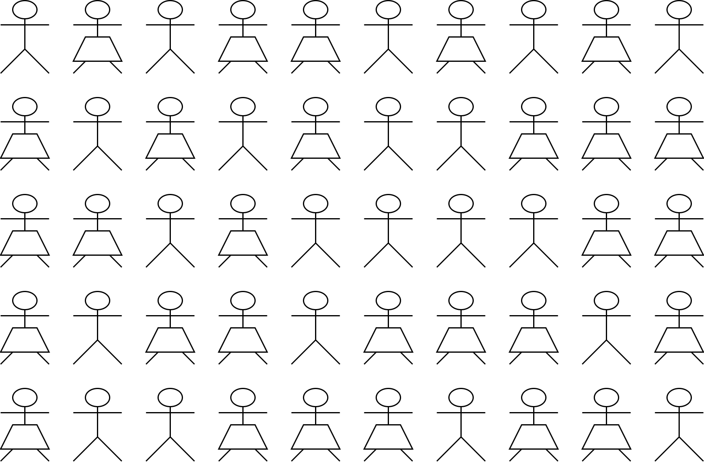
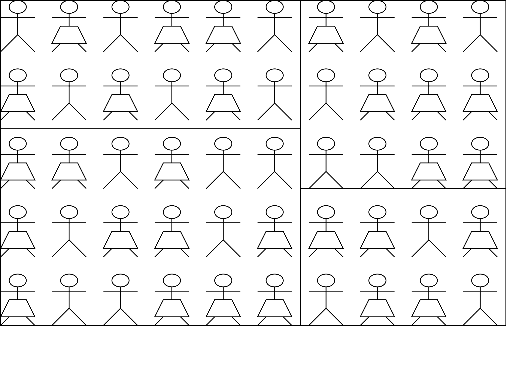

\vspace*{-1in}

# Simulate sampling

Here we will practice the various sampling strategies to collect samples of size $n=20$.  

Proceed to do each of the sampling strategies we learned. Circle a person to indicate that they are included in the sample.

- For convenience sampling, choose one place to "stand". The nearest 20 people are your sample. 
- For random sampling, use R to randomly sample numbers, which correspond to the position of the people that will be in your sample. Set your seed to be your birthday (month and day).
  - For cluster and multistage sampling, choose 2 groups to sample.

\vspace*{1cm}

{height=300}

{height=300}

{height=300}

{height=300}

{height=300}

\newpage

# Reflection questions

## Question 1

What was your population proportion of people wearing a trapezoid?

\vspace*{1in}

## Question 2

What was your sample proportion of people wearing a trapezoid, for your simple random sample?

\vspace*{1in}

## Question 3

Ask 5 people in class what their sample proportions were and report them here.

\vspace*{1in}

## Question 4

Why do we want to avoid convenience sampling?
