```{r}
#| echo: false
library(tidyverse)
library(patchwork)

theme_set(theme_bw(base_size = 24))

elephants <- read_csv(
  "http://csuci-data308-fa26.github.io/course-materials/data/elephants.csv",
  show_col_types = FALSE
)
```


# Understanding the variation in our estimates

## Theoretical population regression line

We said our theoretical model is 
$$Y_i = \beta_0 + \beta_1 X_i + \epsilon_i.$$

It is theoretical because we are saying if we had all of the data for our population, a census instead of a sample, it would be the best linear approximation for the relationship between $X$ and $Y$.

Realistically we will almost never have a census, so $\beta_0$ and $\beta_1$ are unknown in practice.

# Simulations

I will simulate multiple studies so we can explore how our results can differ!


## Simulation: population data

```{r}
#| echo: false

set.seed(3775)

pop_n <- 2500
sigma <- 3
beta_0 <- 2
beta_1 <- 3

sample_n <- 50

pop_data <- data.frame(
  epsilon = rnorm(n = pop_n, mean = 0, sd = sigma),
  x = runif(n = pop_n, min = -2, max = 2)
) |> 
  mutate(y = beta_0 + beta_1 * x + epsilon)
```

Simulated data for a population of `r pop_n` individuals.

::::{.columns}

:::{.column width="50%"}

```{r}
#| fig-align: center
#| echo: false
ggplot(pop_data, aes(x = x, y = y)) +
  geom_point() +
  geom_smooth(method = "lm", se = FALSE)
```

:::

:::{.column width="50%"}

1. randomly generate $x$'s (fake explanatory variable).
2. randomly generate $\epsilon$'s (random noise with $E[\epsilon_i] = 0$ for all $i=1,...n$).
3. calculate $y$'s with $y_i = 3 + 2 x_i + \epsilon_i$.

:::

::::

## Simulation: population data

Truth: $y_i = 3 + 2 x_i + \epsilon_i$

::::{.columns}

:::{.column width="50%"}

```{r}
#| fig-align: center
#| echo: false
ggplot(pop_data, aes(x = x, y = y)) +
  geom_point() +
  geom_smooth(method = "lm", se = FALSE)
```

:::

:::{.column width="50%"}

Next we will pretend we are different researchers collecting a sample of 50 observations each from this population and fitting a simple linear regression model.

Let's see how different our results could be!

:::

::::

```{r}
#| echo: false
#| eval: false

pop_data$id <- 1:nrow(pop_data)

set.seed(2359)

sample_data <- NULL
estimate_df <- NULL

for (i in 1:1000) {
  sample_ids <- sample(pop_n, size = sample_n, replace = FALSE)
  
  sample_name <- paste0("in_sample_", i)
  pop_data[, sample_name] <- pop_data$id %in% sample_ids
  lm_model <- lm(y ~ x, data = filter(pop_data, .data[[sample_name]]))
  ci <- confint(lm_model, parm = "x")

  estimate_df <- data.frame(
    beta0_hat = lm_model$coefficients["(Intercept)"],
    beta1_hat = lm_model$coefficients["x"],
    beta1_95ci_lb = ci[1],
    beta1_95ci_ub = ci[2],
    sample_id = i
  )  |> 
    bind_rows(estimate_df)
}

write_csv(pop_data, "data/sim-sample-data.csv")
write_csv(estimate_df, "data/sim-estimate-df.csv")
```

```{r}
#| echo: false
#| eval: false

pop_data <- read_csv("data/sim-sample-data.csv", show_col_types = FALSE)
estimate_df <- read_csv("data/sim-estimate-df.csv", show_col_types = FALSE) |> 
  mutate(covers_true_value = beta1_95ci_lb <= 3 & beta1_95ci_ub >= 3) |> 
  mutate(covers_true_value = factor(covers_true_value, levels = c(FALSE, TRUE)))

beta0_lims <- c(min(estimate_df$beta0_hat), max(estimate_df$beta0_hat))
beta1_lims <- c(min(estimate_df$beta1_hat), max(estimate_df$beta1_hat))
beta1_ci_lims <- c(min(estimate_df$beta1_95ci_lb), max(estimate_df$beta1_95ci_ub))

produce_sim_sample_plots <- function(sample_num, plot_font_size = 15) {
  sample_name <- paste0("in_sample_", sample_num)
  
  p1 <- pop_data |> 
    select(x, y, id, sample_name) |> 
    ggplot(aes(x = x, y = y, color = .data[[sample_name]], alpha = .data[[sample_name]])) +
    geom_point() +
    scale_color_manual(
      values = c(
        "TRUE" = "black",
        "FALSE" = "lightgray"
      )
    ) +
    scale_alpha_manual(
      values = c(
        "TRUE" = 1,
        "FALSE" = 0.5
      )
    ) +
    geom_abline(
      intercept = beta_0, 
      slope = beta_1, 
      color = "blue", 
      size = 1.5
    ) +
    geom_abline(
      intercept = filter(estimate_df, sample_id == sample_num) |> pull(beta0_hat), 
      slope = filter(estimate_df, sample_id == sample_num) |> pull(beta1_hat),  
      color = "red", 
      size = 1, 
      linetype = "dashed"
    ) +
    labs(
      color = "In sample:",
      alpha = "In sample:",
      title = "Population versus sample"
    ) +
    theme_minimal(base_size = plot_font_size) +
    theme(legend.position = "top")
    
  p2 <- estimate_df |> 
    filter(sample_id <= sample_num) |> 
    ggplot(aes(x = beta1_hat)) +
    geom_histogram(binwidth = 0.25, color = "black", fill = "grey") +
    geom_vline(
      xintercept = beta_1,
      color = "blue",
      size = 2
    ) +
    lims(x = beta1_lims) +
    labs(
      x = "Estimated Beta 1",
      y = "Count"
    )  +
    theme_minimal(base_size = plot_font_size)
        
  ci_data <- estimate_df |>
    filter(sample_id <= sample_num)
  
  prop_coverage <-
    paste0(
      round(
        100 *sum(ci_data$covers_true_value == "TRUE") / nrow(ci_data), 
        2
      ), 
      "%"
    )
      
  if(sample_num <= 100) {
    ci_y_max <- 100
  } else {
    ci_y_max <- nrow(estimate_df)
  }
  
  p3 <- 
    ggplot(
      ci_data,
      aes(
        y = sample_id,
        x = beta1_hat,
        xmin = beta1_95ci_lb,
        xmax = beta1_95ci_ub,
        color = covers_true_value
      )
    ) +
    geom_errorbar(
      orientation = "y",
      width = 0,
      alpha = 0.5
    ) +
    scale_color_viridis_d(drop = FALSE, limits = c("FALSE", "TRUE")) +
    geom_point() +
    geom_vline(
      xintercept = 3,
      color = "blue",
      linewidth = 1
    ) +
    lims(y = c(0, ci_y_max), x = beta1_ci_lims) +
    labs(
      x = "Beta 1", 
      y = "Sample", 
      color = "Covers:",
      title = paste0("95% CI (Actual coverage ", prop_coverage, ")")
    ) +
    theme_minimal(base_size = plot_font_size) +
    theme(legend.position = "top")
    
  (p1 / p2) | p3
  ggsave(paste0("img/sim-", sample_num, "-plot.png"), width = 10, height = 5)

}
```

```{r}
#| echo: false
#| eval: false

produce_sim_sample_plots(1)
produce_sim_sample_plots(2)
produce_sim_sample_plots(3)
produce_sim_sample_plots(4)
produce_sim_sample_plots(5)
produce_sim_sample_plots(10)
produce_sim_sample_plots(30)
produce_sim_sample_plots(50)
produce_sim_sample_plots(100)
produce_sim_sample_plots(250)
produce_sim_sample_plots(500)
produce_sim_sample_plots(750)
produce_sim_sample_plots(1000)

```


## Simulation: Sample 1

```{r}
#| fig-align: center
#| echo: false

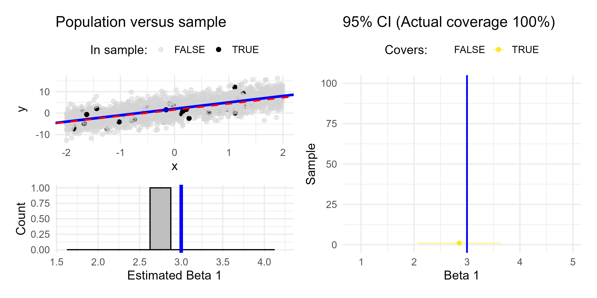
```

## Simulation: Sample 2

```{r}
#| fig-align: center
#| echo: false

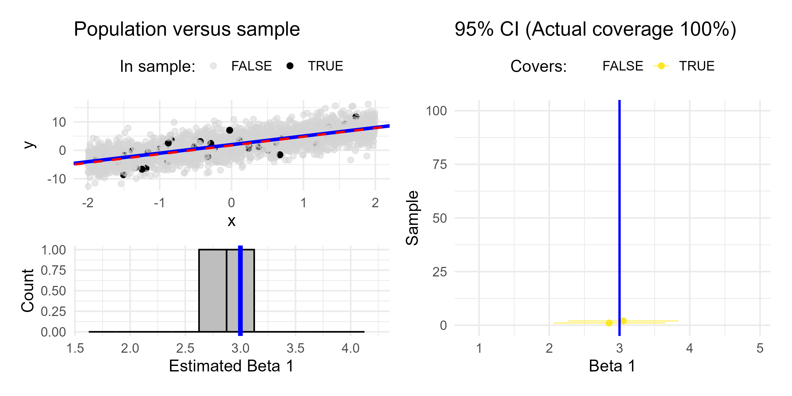
```

## Simulation: Sample 3

```{r}
#| fig-align: center
#| echo: false

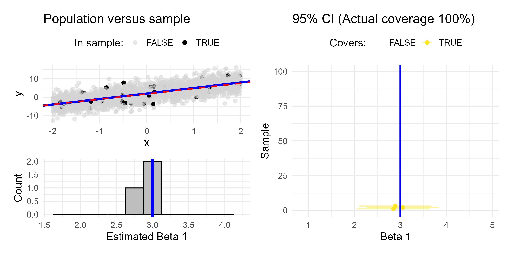
```

## Simulation: Sample 4

```{r}
#| fig-align: center
#| echo: false

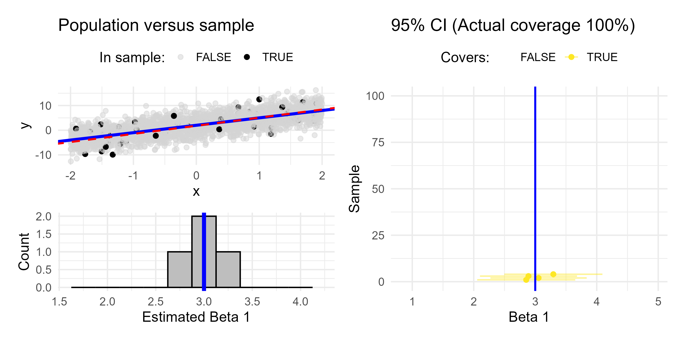
```

## Simulation: Sample 5

```{r}
#| fig-align: center
#| echo: false


```

## Simulation: Sample 10

```{r}
#| fig-align: center
#| echo: false

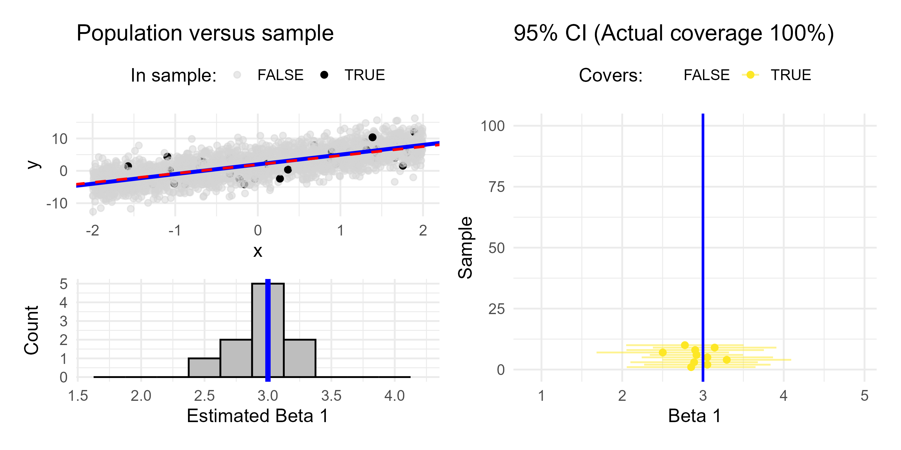
```

## Simulation: Sample 30

```{r}
#| fig-align: center
#| echo: false

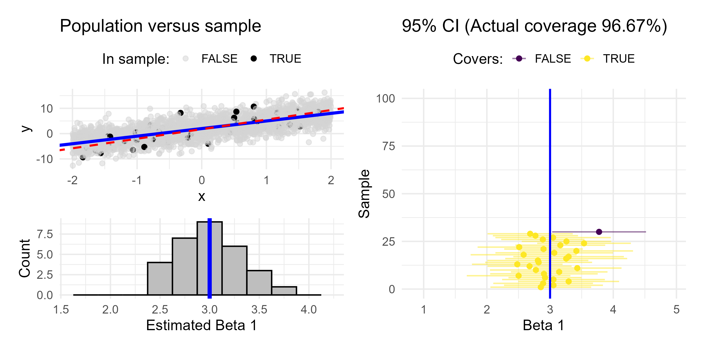
```

## Simulation: Sample 50

```{r}
#| fig-align: center
#| echo: false

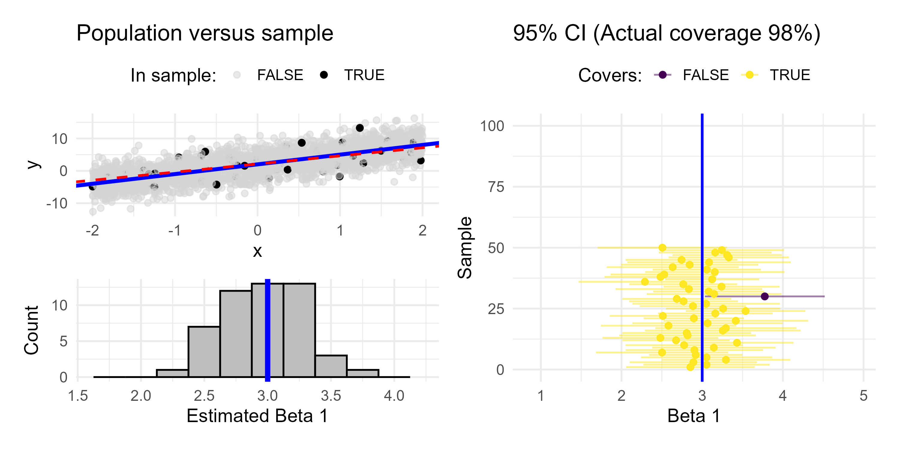
```

## Simulation: Sample 100

```{r}
#| fig-align: center
#| echo: false

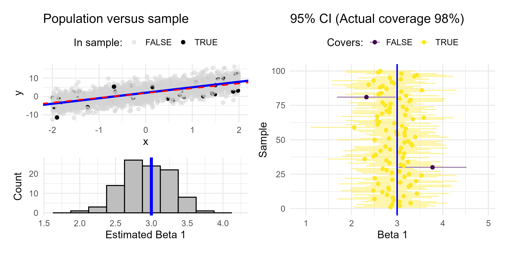
```

## Simulation: Sample 250

```{r}
#| fig-align: center
#| echo: false

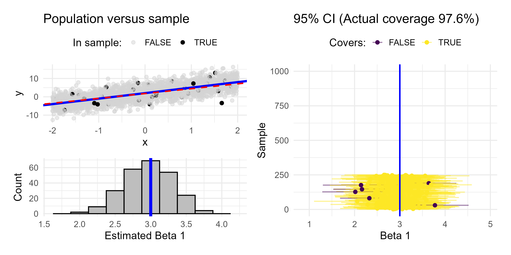
```

## Simulation: Sample 500

```{r}
#| fig-align: center
#| echo: false

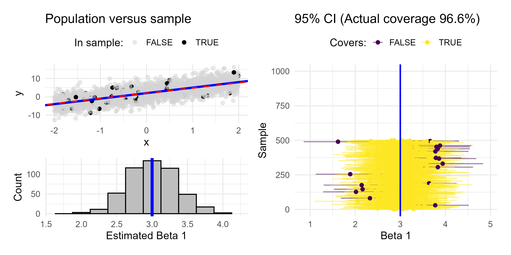
```

## Simulation: Sample 750

```{r}
#| fig-align: center
#| echo: false

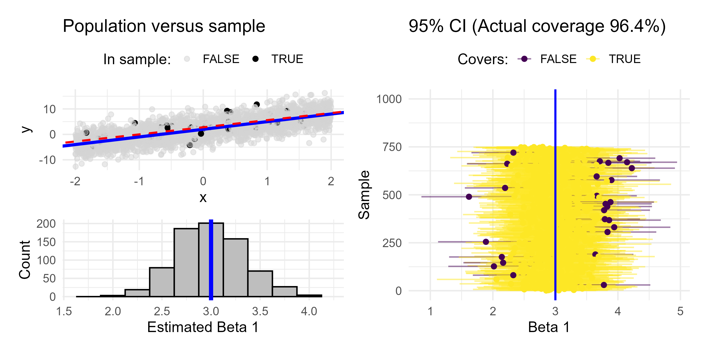
```

## Simulation: Sample 1000

```{r}
#| fig-align: center
#| echo: false

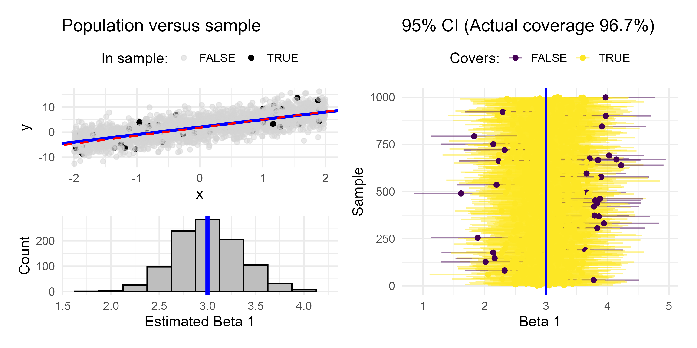
```

## Takeaways

- different studies can get different results (i.e., different $\hat{\beta}_0$ & $\hat{\beta}_1$)
- those different estimates should be centered around the true $\beta_0$ and $\beta_1$
- we can quantify a range of plausible values

. . .

*Note I only showed the results for $\beta_1$, but the same holds true for $\beta_0$!*

## Unbiased estimators

What we just saw was the sampling distribution of  $\hat{\beta}_1$.

The least squares estimators $\hat{\beta}_0$ and $\hat{\beta}_1$ from many random samples will tend towards the true parameters $\beta_0$ and $\beta_1$.

> $\hat{\beta}_0$ and $\hat{\beta}_1$ are unbiased estimators for $\beta_0$ and $\beta_1$!
> $E[\hat{\beta}_0] = \beta_0$ and $E[\hat{\beta}_1] = \beta_1$
  
. . .

**BUT we don't know if $\hat{\beta}_0 = \beta_0$ and $\hat{\beta}_1 = \beta_1$!**

## Understanding variability with a single sample

*In practice we typically only have one sample and the estimates from a single sample may be fairly different from the true parameters by chance.*

This is why we should use uncertainty estimates when using our estimators!

# Confidence Intervals

> Confidence level $\neq$ probability

The confidence interval is the long-term proportion of confidence intervals that will capture the true parameter (either $\beta_0$ or $\beta_1$)

## Confidence interval formula

We can use our point estimates $\hat{\beta}_0$ and $\hat{\beta}_1$ along with our standard error estimates $SE(\hat{\beta}_0)$ and $SE(\hat{\beta}_1)$ to provide confidence intervals

$$\hat{\beta}_0 \pm \text{Margin of error} = \hat{\beta}_0 \pm t^* SE(\hat{\beta}_0)$$

$$\hat{\beta}_1 \pm \text{Margin of error} = \hat{\beta}_1 \pm t^* SE(\hat{\beta}_1)$$

- $t^*$ is a multiplier that adjusts for confidence level

## Standard error of least squares estimates

$$SE(\hat{\beta}_0) = \sqrt{\sigma^2 \left(\frac{1}{n} + \frac{\bar{x}^2}{\sum_{i=1}^{n} (x_i - \bar{x})^2}\right)}$$
$$SE(\hat{\beta}_1) = \sqrt{\frac{\sigma^2}{\sum_{i=1}^{n} (x_i - \bar{x})^2}}$$

- `summary()` of your linear model will display standard error

<!-- . . . -->

<!-- Do you notice an issue with calculating $SE(\hat{\beta}_0)$ and $SE(\hat{\beta}_1)$? -->

<!-- ## In practice -->

<!-- We use *Residual Standard Error* (RSE)  -->

<!-- $$RSE = \hat{\sigma} = \sqrt{RSS / (n - 2),}$$ since $E[\hat{\sigma}^2] = \sigma^2$ -->

<!-- . . . -->

<!-- Technically what we calculate are estimates of the uncertainty estimators: $\hat{SE(\hat{\beta}_0)}$ and $\hat{SE(\hat{\beta}_1)}$ -->

<!-- ## SE and RSE in model output -->

<!-- ```{r} -->
<!-- elephant_model <- lm(Mass ~ Height, data = elephants) -->
<!-- summary(elephant_model) -->
<!-- ``` -->

## Computing confidence intervals in practice

The `confint()` function will computer 95% confidence intervals (industry standard) by default
```{r}
#| echo: true
elephants <- read_csv(
  "http://csuci-data308-fa26.github.io/course-materials/data/elephants.csv"
) |> 
  janitor::clean_names()

elephant_model <- lm(mass ~ height, data = elephants)
confint(elephant_model)
```

## Other confidence levels

We can specify other confidence levels
```{r}
#| echo: true
confint(elephant_model, level = 0.90)
confint(elephant_model, level = 0.80)
confint(elephant_model, level = 0.50)
```

## Interpreting confidence intervals


```{r}
#| echo: true
ci <- confint(elephant_model)["height", ]
# confidence interval
ci 
# margin of error
(ci[2] - ci[1]) / 2 
```

```{r}
#| echo: false

margin_of_error <- (ci[2] - ci[1]) / 2
```

Interpretation in context (as interval):
*A 1 cm increase in height of elephants is associated with an higher mass of `r round(elephant_model$coefficients["Height"], 1)` between `r round(ci[1], 1)` kg to `r round(ci[1], 1)` kg, with 95% confidence.*

Interpretation in context (as margin of error):
*A 1 cm increase in height of elephants is associated with an higher mass of `r round(elephant_model$coefficients["Height"], 1)` plus or minus `r round(margin_of_error, 1)` kg, with 95% confidence.*

# Takeaways

- $\hat{\beta_0}$ and $\hat{\beta}_1$ are unbiased estimators of $\beta_0$ and $\beta_1$
- Confidence intervals:
  - definition
  - increase in confidence level = ?
  - increase in sample size = ?
  - how to obtain using `r`
  - margin of error
  
*Use [this applet](https://www.rossmanchance.com/applets/2021/confsim/ConfSim.html) to explore what happens to the width of the confidence interval as you change confidence level and sample size (separately).*

# Prediction intervals

People commonly confuse confidence and prediction intervals. When making a prediction, our uncertainty depends on who we are predicting for

- confidence intervals are for average response
- prediction intervals are for response of a particular individual

*Either way, we should avoid predicting for values outside the range of what we have observed (extrapolation)! *

## Calculating and interpreting intervals for predictions

```{r}
#| echo: true
new_data <- data.frame(height = 200)

predict(elephant_model, newdata = new_data, interval = "confidence")

predict(elephant_model, newdata = new_data, interval = "prediction")
```

```{r}
pred_ci <- round(
  predict(elephant_model, newdata = new_data, interval = "confidence"),
  1
)
pred_pi <- round(
  predict(elephant_model, newdata = new_data, interval = "prediction"),
  1
)
```


For elephants 200 cm tall, we predict their mean weight to be `r pred_ci[1]` kg, between `r pred_ci[2]` and `r pred_ci[3]` kg, with 95% confidence.

For an elephant 200 cm tall, we predict its weight to be `r pred_pi[1]` kg, between `r pred_pi[2]` and `r pred_pi[3]` kg, with 95% confidence.


