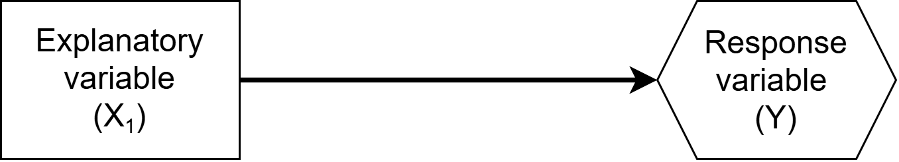
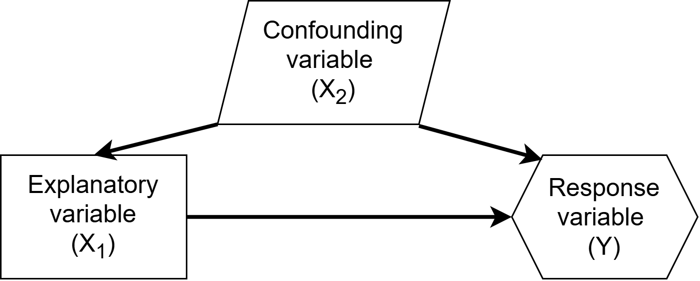
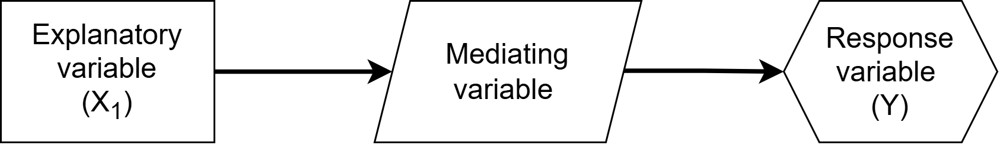
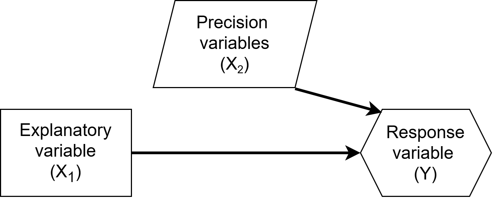
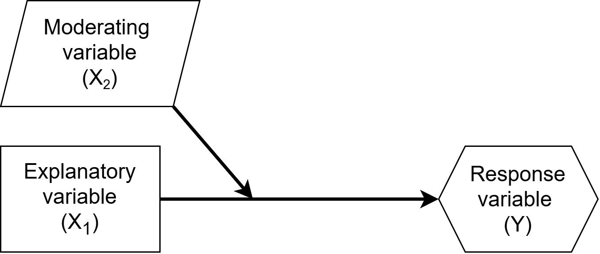

```{r}
#| echo: false

library(tidyverse)
theme_set(theme_bw(base_size = 24))
```

## After learning multiple linear regression...

The next natural questions are:

1. Does that change or add any assumptions to our model?
2. What variables should I add as $X's$ in addition to my primary explanatory variable of interest?


# 1. Conditions

Multiple linear regression has 5 conditions:

1. Linearity (appropriate functional form)
2. Independence of observations
3. Constant variance of errors
4. Normality of errors
5. **No perfect collinearity**

## Perfect collinearity

Perfect collinearity =  An $X_j$ is a perfect linear combination of another

- e.g., Using SAT Math, SAT Reading, & SAT total (total = math + reading) as 3 $X$'s

Cannot fit model mathematically so statistical software will drop at least one $X$

## High Collinearity

High collinearity = highly correlated $X$'s

- e.g., Suppose we wanted to include SAT Math & SAT Reading as 2 $X$'s


Results in: 

- larger standard errors of $\hat{\beta}$'s for highly correlated $X$'s
- difficulty separating the association between $Y$ and $X_j$ from $Y$ and $X_k$
- mathematical instability resulting in high sensitivity of results to sample

## High Collinearity

Remedy:

- Determine whether both variables are scientifically necessary
- Do not remove an important confounding variable solely because it is highly correlated with another predictor
  - Note: VIF is discussed in the ISL textbook, but we should not remove a variable only because it has a high VIF

# 2. Choosing $X$'s

| Goal | Guiding question | General Approach |
|:-----|:------------------|:------------------|
| Prediction | Which model predicts new outcomes most accurately? | *(next slide)* |
| Inference | What is the primary relationship of interest? | Prespecify model using research question & subject-matter knowledge |


## Model selection for prediction

Selecting a model for prediction requires evaluating how well candidate models perform on new observations. 

- *Techniques such as cross-validation, model selection, and regularization are beyond the scope of this course and are covered in Chapters 5 and 6 of ISL textbook and in MATH 398 and MATH 408.*

## Model selection for inference

Prespecification of your model = deciding on your model before looking at the data

- In observational studies, we interpret regression coefficients as adjusted associations
  - E.g., An expected change in $Y$ associated with a 1 unit increase in $X$
- Accounting for plausible confounders can strengthen a causal argument, but regression adjustment alone is insufficient to establish causation.

## Variable relationships

There are more types of relationships than just explanatory, response, and confounders

- The way that a variable is related the the explanatory and response dictates whether and how the additional variable should be included in our model

## Variables of primary interest



In study design our outcome of interest is our *response variable*, and our primary variable we think explains this variable is the *explanatory variable*.

Example: Sleep quality ($X_{1}$) affects academic achievement ($Y$)


## Variables of primary interest: what to do


- Choose a model appropriate for the variable type of the response $Y$
- Incorporate the explanatory variable as an $X_1$

## Confounding variables



- Are causally related to both the explanatory and response variable

Example: Stressful home environment can affect sleep quality and academic achievement

## Confounding variables: what to do


- are controlled for in experiments where there is random assignment of the explanatory variable / treatment
- need to be accounted for in observational studies (as an additional $X$)

## Mediating variables



- explain the process or mechanism of the relationship between the explanatory and response variables

Example: Sleep quality affects academic achievement through the mediator of alertness


## Mediating variables: what to do


- Should not be controlled for (added to model) because we would lose the relationship between $X$ and $Y$

## Precision variables



- Variables only related to response variable and not explanatory


## Precision variables: what to do


- Consider adding them to increase precision (reduce variable) of our estimates, if they are highly related to response variable


## Moderating variables



- Affects the strength or direction of the relationship between the explanatory and response variable

Example: The relationship between sleep quality and academic achievement probably differs for children versus adults.


## Moderating variables: what to do


- Account for with an interaction between the moderating and explanatory variable (*will cover on 10/13*)

# An approach to prespecifying your model

When it comes time for you to decide on a model on your own, there are many considerations.
**Your decisions should be informed by contextual knowledge**, which would be available in real practice, but can often be difficult for classroom examples.

- Next I will provide you with a general approach to building your model.

## Prespecification approach

1. Identify your response variable & its type. Choose an appropriate model for its type (*So far we only know linear regression for continuous variables*).
2. Identify your primary explanatory variable of interest. Specify it as $X_1$.
3. Identify variables potentially causally related to $Y$. Among these variables, decide if they are related to $X_1$.
4. For variables only related to $Y$, if they are strongly related, consider adding them as precision variables.

## Prespecification approach

5. For observational studies: Among the remaining variables, decide if they are potentially causally related to both $X_1$ and $Y$. Include potential confounders as additional $X_j$'s.
6. Omit variables that are likely mediators
7. 
